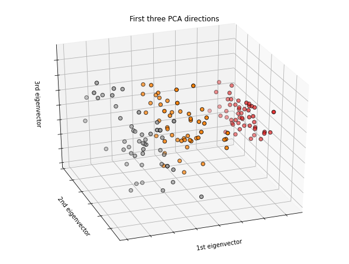

{}

## Part 1 of a series to revisit popular machine learning models

### In this part I will revisit **KNN (K nearest neighbours)** in ```Python```

- Click [here](https://en.wikipedia.org/wiki/K-nearest_neighbors_algorithm) for detailed explanation of KNN
- Essentially, it's about a sample is classified by popularity vote of its nearest neighbors
- I will use [euclidean distance](https://en.wikipedia.org/wiki/Euclidean_distance) for measuring distance between data points

### Data
- iris dataset from **scikit-learn** package


```python
import numpy as np
from collections import Counter
from sklearn import datasets
from sklearn.model_selection import train_test_split
import matplotlib.pyplot as plt
```

### Load iris dataset
- Click [here](https://en.wikipedia.org/wiki/Iris_flower_data_set) for more information on iris dataset


```python
iris = datasets.load_iris()
X, y = iris.data, iris.target
```

### Plot the first three principal components in a 3D scatter plot


```python
from mpl_toolkits.mplot3d import Axes3D
from sklearn.decomposition import PCA
```


```python
x_min, x_max = X[:, 0].min() - .5, X[:, 0].max() + .5
y_min, y_max = X[:, 1].min() - .5, X[:, 1].max() + .5
```


```python
fig = plt.figure(1, figsize=(8, 6))
ax = Axes3D(fig, elev=-150, azim=110)
X_reduced = PCA(n_components=3).fit_transform(iris.data)
ax.scatter(X_reduced[:, 0], X_reduced[:, 1], X_reduced[:, 2], c=y,
           cmap=plt.cm.Set1, edgecolor='k', s=40)
ax.set_title("First three PCA directions")
ax.set_xlabel("1st eigenvector")
ax.w_xaxis.set_ticklabels([])
ax.set_ylabel("2nd eigenvector")
ax.w_yaxis.set_ticklabels([])
ax.set_zlabel("3rd eigenvector")
ax.w_zaxis.set_ticklabels([])
```





We can clearly see that there are three species of Iris flower, marked by different colours


```python
fig.savefig('./pca.png')
```


```python
plt.close()
```


```python
print(f'We have {X.shape[0]} data points and {X.shape[1]} features')
print(f'And, {y.shape[0]} labels')
```

We have 150 data points and 4 features  
And, 150 labels


### Split data into training and testing sets


```python
X_train, X_test, y_train, y_test = train_test_split(X, y, test_size=0.3, random_state=8888)
```


```python
print(f'We have {X_train.shape[0]} data points in the training set')
print(f'And, {y_train.shape[0]} labels in the training set')
print()
print(f'We have {X_test.shape[0]} data points in the training set')
print(f'And, {y_test.shape[0]} labels in the training set')
```

We have 105 data points in the training set  
And, 105 labels in the training set

We have 45 data points in the training set  
And, 45 labels in the training set


### KNN

#### Establish k as the number of clusters


```python
k = 3
```

#### Create a function for calculating euclidean distance


```python
def euclidean_distance(x1, x2):
    return np.sqrt(np.sum((x1 - x2)**2))
```

#### Predict test set by using KNN


```python
predicted_labels=[]
for x in X_test:
    
    # 1. compute the distances
    distances = []
    for x_train in X_train:
        distances.append(euclidean_distance(x, x_train))
    
    # 2. get k nearest neighbours and their labels
    k_nearest_neighbours = np.argsort(distances)[:k]
    k_nearest_neighbours_labels = np.take(y_train, k_nearest_neighbours)
    
    # 3. majority vote, get the most common class label
    most_common_label = Counter(k_nearest_neighbours_labels).most_common(1)
    predicted_labels.append(most_common_label[0][0])
predicted_labels = np.array(predicted_labels)
```

#### Calculate accuracy of predictions
$\frac{\text{Number of correct predictions}}{\text{Number of labels in the test set}}$


```python
accuracy = np.sum(predicted_labels == y_test) / len(y_test)
print(f'The accuracy of the prediction is {accuracy:.2%}')
```

The accuracy of the prediction is 97.78%


#### Put everything in a class


```python
class KNN:

    def __init__(self, k=3):
        self.k = k

    def fit(self, X, y):
        self.X_train = X
        self.y_train = y

    def predict(self, X):
        y_pred = [self._predict(x) for x in X]
        return np.array(y_pred)

    def _predict(self, x):
        distances = [euclidean_distance(x, x_train) for x_train in self.X_train]
        k_nearest_neighbours = np.argsort(distances)[:self.k]
        k_nearest_neighbours_labels = np.take(self.y_train, k_nearest_neighbours)
        most_common_label = Counter(k_nearest_neighbours_labels).most_common(1)
        return most_common_label[0][0]
```


```python
model = KNN(k=3)
model.fit(X_train, y_train)
predictions = model.predict(X_test)
print(f'{predictions.shape[0]} predictions')
accuracy = np.sum(predictions == y_test) / len(y_test)
print(f'The accuracy of the prediction is {accuracy:.2%}')
```

45 predictions  
The accuracy of the prediction is 97.78%


#### Let's see what the accuracy is when we set k to 5, i.e. 5 clusters


```python
model = KNN(k=5)
model.fit(X_train, y_train)
predictions = model.predict(X_test)
print(f'{predictions.shape[0]} predictions')
accuracy = np.sum(predictions == y_test) / len(y_test)
print(f'The accuracy of the prediction is {accuracy:.2%}')
```

45 predictions  
The accuracy of the prediction is 95.56%

