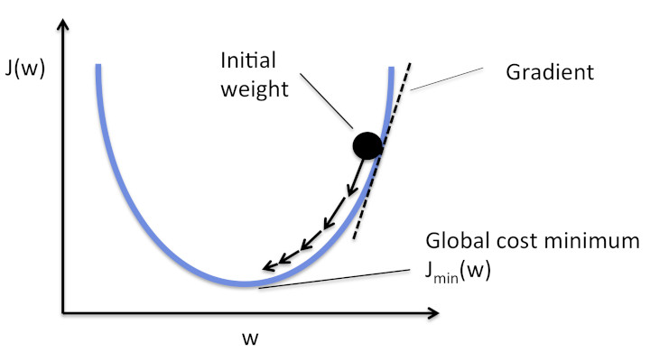
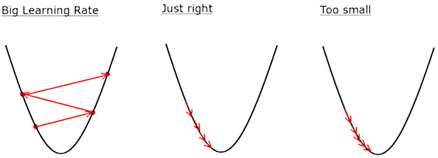
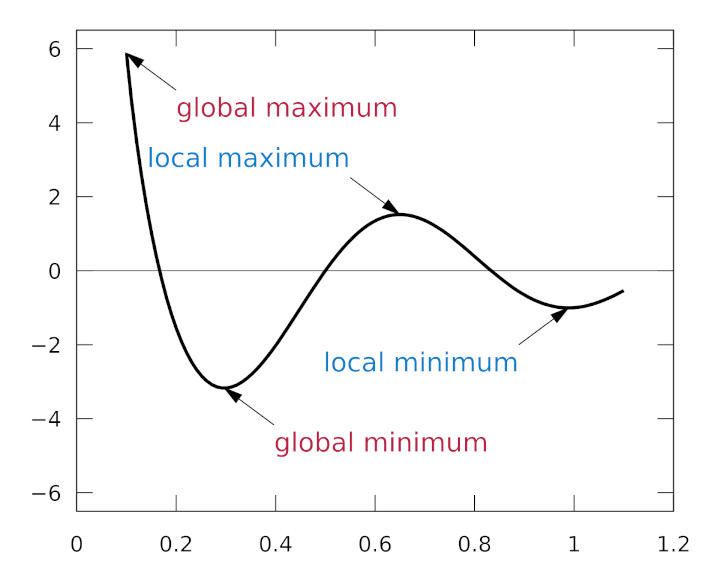
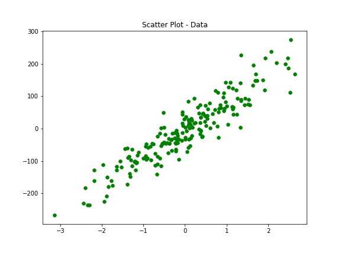
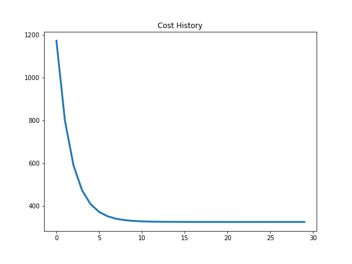
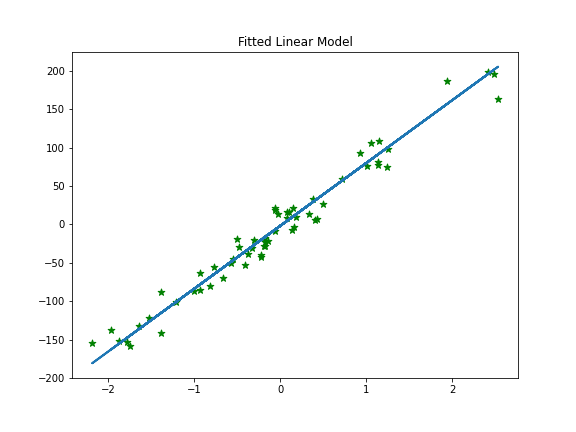

{}

## Part 2 of a series to revisit popular machine learning models

### In this part I will revisit Linear Regression in ```Python```

Linear Regression is a supervised machine learning algorithm where the predicted output is continuous and has a constant slope. It’s used to predict values within a continuous range, (e.g. sales, price) rather than trying to classify them into categories (e.g. cat, dog).

We will explore univariate linear regression, i.e. one feature

### Approximation

$\displaystyle \hat{y} = wx + b$

### Cost function
We will use [mean squared error](https://en.wikipedia.org/wiki/Mean_squared_error) - MSE

$\displaystyle MSE = J(w ,b) = \frac{1}{N} \sum_{i=1}^n (y_i - (wx_i + b))^2$

### Gradient of this cost function

$\displaystyle \begin{align}
J'(w,b) &=
  \begin{bmatrix}
    \frac{dJ}{dw}\\\\
    \frac{dJ}{db}\\\\
  \end{bmatrix}
\\\\&=
  \begin{bmatrix}
    \frac{1}{N} \sum -x_i \cdot 2(y_i - (wx_i + b)) \\\\
    \frac{1}{N} \sum -1 \cdot 2(y_i - (wx_i + b)) \\\\
  \end{bmatrix}\\\\
\\\\&=
  \begin{bmatrix}
     \frac{1}{N} \sum -2x_i(y_i - (wx_i + b)) \\\\
     \frac{1}{N} \sum -2(y_i - (wx_i + b)) \\\\
  \end{bmatrix}
\end{align}$

### Gradient descent

Gradient descent is an optimisation algorithm used to minimise some function by iteratively moving in the direction of steepest descent as defined by the negative of the gradient. 

In machine learning, we use gradient descent to update the parameters of our model. Parameters refer to coefficients in Linear Regression and weights in neural networks.



### Update rules

$\displaystyle \begin{align}
w_{new} &= w_{old} - \alpha \cdot dw
\\\\ b_{new} &= b_{old} - \alpha \cdot db
\end{align}$

$\alpha$ is the **learning rate**

$\displaystyle \begin{align}
\frac{dJ}{dw}=dw
&=\frac{1}{N} \sum_{i=1}^n -2x_i(y_i-(wx_i+b))
\\\\&=\frac{1}{N} \sum_{i=1}^n -2x_i(y_i-\hat{y})
\\\\&=\frac{1}{N} \sum_{i=1}^n 2x_i(\hat{y}-y_i)
\end{align}$

$\displaystyle \begin{align}
\frac{dJ}{db}=db
&=\frac{1}{N} \sum_{i=1}^n -2(y_i-(wx_i+b))
\\\\&=\frac{1}{N} \sum_{i=1}^n -2(y_i-\hat{y})
\\\\&=\frac{1}{N} \sum_{i=1}^n 2(\hat{y}-y_i)
\end{align}$

### Learning rate - $\alpha$



Sometimes **gradient decent** can stop at local maxima i.e. not the global minimum



It is always a good idea to optimise the cost function so that it stops at global minimum. For this we sometimes need to use other gradient descent methods:
- Batch-Gradient Descent
- Stochastic Gradient Descent
- Mini-Batch gradient Descent

### Data


```python
import numpy as np
from sklearn.model_selection import train_test_split
from sklearn import datasets
import matplotlib.pyplot as plt
```


```python
n = 200
```


```python
X, y = datasets.make_regression(n_samples=n, n_features=1, noise=38, random_state=8)
```


```python
fig = plt.figure(figsize=(8,6))
plt.scatter(X[:, 0], y, color = 'g', marker = 'o', s = 30)
plt.title('Scatter Plot - Data')
```





```python
print(f'We have {X.shape[0]} data points and {X.shape[1]} features')
print(f'And, {y.shape[0]} labels')
```

We have 200 data points and 1 features  
And, 200 labels

### Split data into training and testing sets


```python
X_train, X_test, y_train, y_test = train_test_split(X, y, test_size=0.3, random_state=8888)
```


```python
print(f'We have {X_train.shape[0]} data points in the training set')
print(f'And, {y_train.shape[0]} labels in the training set')
print()
print(f'We have {X_test.shape[0]} data points in the training set')
print(f'And, {y_test.shape[0]} labels in the training set')
```

We have 140 data points in the training set  
And, 140 labels in the training set

We have 60 data points in the training set  
And, 60 labels in the training set

### Linear regression

#### Initiate training parameters


```python
learning_rate = 0.1 # alpha
number_of_iter = 30 # umber of iterations
weights = np.zeros(X.shape[1]) # initial weights
bias = 0 # initial bias
```


```python
def y_hat(x, w, b):
    return w*x + b
```


```python
# MSE
def cost_function(X, y, w, b):
    n = len(X)
    total_error = 0.0
    for i in range(n):
        total_error += (y[i] - y_hat(X[i], w, b))**2
    return total_error / n
```


```python
def update_weight(X, y, w, b, learning_rate):
    w_deriv = 0
    b_deriv = 0
    n = len(X)

    for i in range(n):
        # Calculate partial derivatives
        # -2x(y - (mx + b))
        w_deriv += -2*X[i] * (y[i] -  y_hat(X[i], w, b))

        # -2(y - (mx + b))
        b_deriv += -2*(y[i] -  y_hat(X[i], w, b))

    # We subtract because the derivatives point in direction of steepest ascent
    w -= (w_deriv / n) * learning_rate
    b -= (b_deriv / n) * learning_rate

    return w, b
```


```python
def train(X, y, w, b, learning_rate, iters):
    cost_history = []

    for i in range(iters):
        w,b = update_weight(X, y, w, b, learning_rate)

        #Calculate cost for auditing purposes
        cost = cost_function(X, y, w, b)
        cost_history = np.append(cost_history, cost)

        # Log Progress
        if i % 5 == 0:
            print(f'iter={i}    w={np.round(w,4)}    b={np.round(b,4)}    cost={np.round(cost,4)}')          

    return w, b, cost_history
```

#### Train


```python
w_final, b_final, cost_hist = train(X_train, y_train, weights, bias, learning_rate, number_of_iter)
```

    iter=0    w=[57.4947]    b=[-0.1171]    cost=[1171.5092]
    iter=5    w=[77.2985]    b=[-1.1921]    cost=[371.8496]
    iter=10    w=[81.8909]    b=[-1.9297]    cost=[327.9495]
    iter=15    w=[82.9653]    b=[-2.261]    cost=[325.3926]
    iter=20    w=[83.2198]    b=[-2.3906]    cost=[325.2285]
    iter=25    w=[83.281]    b=[-2.4381]    cost=[325.2165]


#### Cost history


```python
fig = plt.figure(figsize=(8,6))
plt.plot(range(len(cost_hist)), cost_hist, linewidth=2.0)
plt.title('Cost History')
```





#### Predict $\hat{y}$ using test set


```python
predicted_y = y_hat(w_final, X_test, b_final)
```

#### Plot fitted line over test dataset


```python
fig = plt.figure(figsize=(8,6))
plt.scatter(X_test, y_test, color = 'g', marker = '*', s = 50) 
plt.plot(X_test, predicted_y, linewidth=2.0)
plt.title('Fitted Linear Model')
```





#### Calculate MSE


```python
cost_function(X_test, y_test, w_final, b_final)[0]
```


    261.52680761233654


```python
np.mean((predicted_y[:,0]-y_test)**2)
```


    261.52680761233654


### Put everything in a class


```python
class Linear_Reg:

    def __init__(self, learning_rate=0.001, n_iters=1000):
        self.lr = learning_rate
        self.n_iters = n_iters
        self.weights = None
        self.bias = None

    def fit(self, X, y):
        n_samples, n_features = X.shape

        # init parameters
        self.weights = np.zeros(n_features)
        self.bias = 0

        # gradient descent
        for _ in range(self.n_iters):
            y_predicted = np.dot(X, self.weights) + self.bias
            # compute gradients
            dw = (1 / n_samples) * np.dot(X.T, (y_predicted - y))
            db = (1 / n_samples) * np.sum(y_predicted - y)

            # update parameters
            self.weights -= self.lr * dw
            self.bias -= self.lr * db
 
    def predict(self, X):
        y_approximated = np.dot(X, self.weights) + self.bias
        return y_approximated
```

#### Train and predict


```python
regressor = Linear_Reg(learning_rate=learning_rate, n_iters=number_of_iter)
regressor.fit(X_train, y_train)
predicted_y = regressor.predict(X_test)
```

#### Calculate MSE


```python
np.mean((predicted_y-y_test)**2)
```


    250.80579436357314


