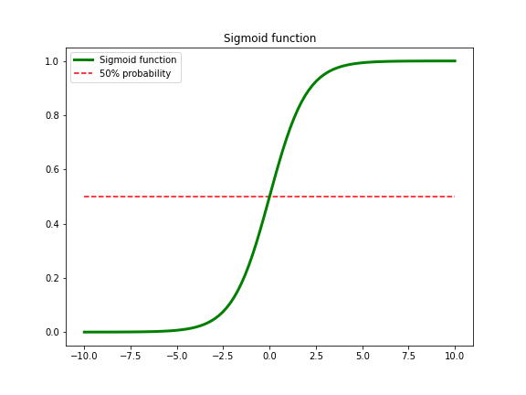
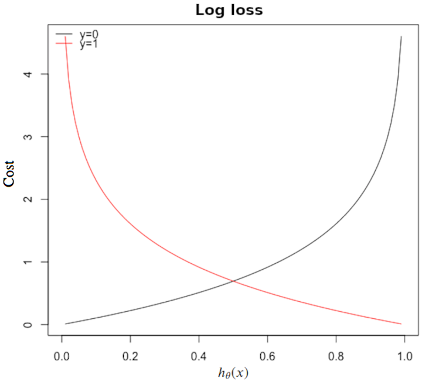
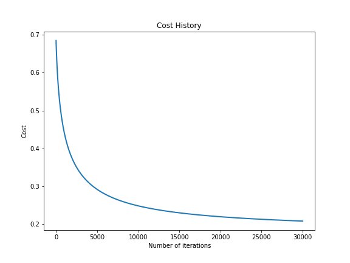

{}

## Part 3 of a series to revisit popular machine learning models

### In this part I will revisit Logistic Regression in ```Python```

Logistic regression is a classification algorithm used to assign observations to a discrete set of classes. Unlike linear regression which outputs continuous number values, logistic regression transforms its output using the logistic sigmoid function to return a probability value which can then be mapped to two or more discrete classes.

We will look at classification of two discrete classes.

### Approximation

$\displaystyle f(w, b) = wx+b$

What we are trying to predict here is very different from [Linear Regression](https://www.shaunwang.me/post/post_003_02_linear_reg/) which does not require output values to be bounded between 0 and 1. In Logistic Regression we require the output values to be bounded between 0 and 1 because we want to predict an "either or" outcome, i.e. either win or lose, either succeed or fail, either pass a test or not, etc. In other words, we wish to predict the probability of scoring a "1" (which can be a "win" in game, a "success" in loan approval, a "pass" in test, etc). And the probability of scoring a "0" (which can be a "loss" in game, a "fail" in loan approval, a "not pass" in test, etc) can naturally be inferred from 1 minus the probability of scoring a "1".

We thus need to apply an **activation a.k.a. transformation function** to the output values of the linear equation to turn an unbounded output to a probability which is bounded between 0 and 1.

### Activation function - sigmoid function

$\displaystyle s(z) = \frac{1}{1+e^{-z}}$

Make a function for sigmoid activation to be used later:


```python
import numpy as np

def sigmoid(z):
    return 1 / (1 + np.exp(-z))
```

Plotting of the sigmoid function:


```python
import matplotlib.pyplot as plt

x=np.linspace(-10,10,100)
fig = plt.figure(figsize=(8,6))
plt.plot(x,sigmoid(x),'g', label='Sigmoid function', linewidth=3.0)
plt.hlines(0.5, x.min(),x.max(), 'r', '--', label='50% probability')
plt.legend()
plt.title('Sigmoid function')
```





The horizontal line represents 0.5 or 50% probability. If 0.5 is our threshold, any output values which are greater than 0.5 will be interpreted as 1 i.e. a success; and any output values which are less than 0.5 will be interpreted as 0 i.e a fail.

Approximation then becomes

$\displaystyle \hat{y} = h_\theta(x)=\frac{1}{1+e^{-(wx+b)}} $

As we can see that the equation is no longer **linear** after the sigmoid transformation. We thus can NOT use MSE as our cost function for [gradient descent](https://www.shaunwang.me/post/post_003_02_linear_reg/#gradient-descent) because squaring this prediction as we do in MSE results in a non-convex function with many local minimums. If our cost function has many local minimums, gradient descent may not find the optimal global minimum.

We will use a cost function called [Cross-Entropy](https://en.wikipedia.org/wiki/Cross_entropy), also known as log loss. Cross-entropy loss can be divided into two separate cost functions: one for $y=1$ and one for $y=0$.

$\displaystyle J(\theta)=\frac{1}{N} \sum_{i=1}^n \text{Cost}(h_\theta(x^i),y^i)$

$\displaystyle \text{Cost}(h_\theta(x),y)=
\begin{cases}
-\log(h_\theta(x)) & \text{if } y=1 \\\\
\\\\
-\log(1-h_\theta(x)) & \text{if } y=0
\end{cases}$



The cost function penalises confident and wrong predictions more than it rewards confident and right predictions! The corollary is increasing prediction accuracy (closer to 0 or 1) has diminishing returns on reducing cost due to the logistic nature of our cost function.

Strictly speaking cross-entropy and log loss are slightly different depending on context, but when calculating cost between 0 and 1 they resolve to the same thing.

### Cost function

$\displaystyle J(\theta)=-\frac{1}{N} \sum_{i=1}^n \left(y^i\log(h_\theta(x^i)+(1-y^i)\log(1-h_\theta(x^i))\right)$

Multiplying by $y$ and $(1−y)$ in the above equation is a sneaky trick that let’s us use the same equation to solve for both $y=1$ and $y=0$ cases. If $y=0$, the first side cancels out. If $y=1$, the second side cancels out. In both cases we only perform the operation we need to perform.

### Gradient descent and update rules

#### Gradient

We have:

$\displaystyle z=w\cdot x + b$

$\displaystyle \hat{y}=s(z)=\frac{1}{1+e^{-z}}$

$\displaystyle \begin{align}
\text{Cost function} &= L(\hat{y},y) \\\\
&= -y \cdot \log \hat{y} - (1-y) \cdot \log (1-\hat{y})
\end{align}$

Applying the chain-rule:

$\displaystyle \dfrac{dL}{dw} = \dfrac{dL}{d\hat{y}} \cdot \dfrac{d\hat{y}}{dz} \cdot \dfrac{dz}{dw}$

$\displaystyle \begin{align}
\dfrac{dL}{d\hat{y}} &= \dfrac{d\left(-y \cdot \log \hat{y} - (1-y) \cdot \log (1-\hat{y})\right)}{d\hat{y}} \\\\
&= -y \cdot \left( \frac{1}{\hat{y}} \right)-(-1) \cdot \frac{1-y}{1-\hat{y}} \\\\
&= \frac{-y}{\hat{y}}+\frac{1-y}{1-\hat{y}}
\end{align}$

Only one row and one iteration is shown here so it is not further divided by $N$ to get average cost. But in reality we would have many rows, we will then apply the average.

$\displaystyle \begin{align}
\dfrac{d\hat{y}}{dz} &= \dfrac{d}{dz} \left[ \dfrac{1}{1 + e^{-z}} \right] \\\\
&= \dfrac{d}{dz} \left( 1 + \mathrm{e}^{-z} \right)^{-1} \\\\
&= -(1 + e^{-z})^{-2}(-e^{-z}) \\\\
&= \dfrac{e^{-z}}{\left(1 + e^{-z}\right)^2} \\\\
&= \dfrac{1}{1 + e^{-z}\ } \cdot \dfrac{e^{-z}}{1 + e^{-z}}  \\\\
&= \dfrac{1}{1 + e^{-z}\ } \cdot \dfrac{(1 + e^{-z}) - 1}{1 + e^{-z}} \\\\
&= \dfrac{1}{1 + e^{-z}\ } \cdot \left( \dfrac{1 + e^{-z}}{1 + e^{-z}} - \dfrac{1}{1 + e^{-z}} \right) \\\\
&= \dfrac{1}{1 + e^{-z}\ } \cdot \left( 1 - \dfrac{1}{1 + e^{-z}} \right) \\\\
&= s(z) \cdot (1 - s(z)) \\\\
&= \hat{y} \cdot (1 - \hat{y})
\end{align}$

$\displaystyle \dfrac{dz}{dw} = x$

$\displaystyle \begin{align}
\dfrac{dL}{dw} &= \dfrac{dL}{d\hat{y}} \cdot \dfrac{d\hat{y}}{dz} \cdot \dfrac{dz}{dw} \\\\
&= \left[ \left( \frac{-y}{\hat{y}}+\frac{1-y}{1-\hat{y}} \right) \cdot \hat{y} \cdot (1 - \hat{y}) \right] \cdot x \\\\
&= \left(\hat{y}-y \right) \cdot x
\end{align}$

$\displaystyle \text{Hence, } \dfrac{dL}{dz} = (\hat{y}-y)$

#### Update rules

$\displaystyle w_{new} = w_{old} - \alpha \cdot \dfrac{dL}{dw}$

Similarly,

$\displaystyle b_{new} = b_{old} - \alpha \cdot \dfrac{dL}{db}$

Where,

$\displaystyle \dfrac{dL}{db} = \hat{y}-y$

### Data

We are using the [Breast Cancer Wisconsin (Diagnostic) Data Set](https://archive.ics.uci.edu/ml/datasets/Breast+Cancer+Wisconsin+(Diagnostic))

|                              |              |                         |   |                       |          |
|:-----------------------------|:-------------|:------------------------|--:|:----------------------|:---------|
|**Data Set Characteristics:** |Multivariate  |**Number of Instances:** |569|**Area:**              |Life      |
|**Attribute Characteristics:**|Real          |**Number of Attributes:**|32 |**Date Donated:**      |1995-Nov-1st|
|**Associated Tasks:**         |Classification|**Missing Values?**      |No |**Number of Web Hits:**|1300636   |

Attribute Information:
1. ID number
2. Diagnosis (M = malignant, B = benign)

### Split data into training and testing sets


```python
from sklearn.model_selection import train_test_split
from sklearn import datasets
```


```python
bc = datasets.load_breast_cancer()
X, y = bc.data, bc.target
X_train, X_test, y_train, y_test = train_test_split(X, y, test_size=0.3, random_state=8888)
```


```python
print(f'We have {X_train.shape[0]} data points in the training set')
print(f'And, {y_train.shape[0]} labels in the training set')
print()
print(f'We have {X_test.shape[0]} data points in the training set')
print(f'And, {y_test.shape[0]} labels in the training set')
print()
print(f'And, {X_train.shape[1]} features')
```

We have 398 data points in the training set<br>
And, 398 labels in the training set

We have 171 data points in the training set<br>
And, 171 labels in the training set

And, 30 features


### Logistic regression

#### Initiate training parameters


```python
learning_rate = 0.000001 # alpha
number_of_iter = 30000 # number of iterations
n, m = X_train.shape
weights = np.zeros(m) # initial weights
bias = 0 # initial bias
```

#### Model


```python
def y_hat(x, w, b):
#   Returns 1D array of probabilities
#   that the class label == 1
    z = np.dot(x, w) + b
    return sigmoid(z)
```


```python
def cost_function(X, y, w, b):
    
    n = len(y)

    predictions = y_hat(X, w, b)

    # Take the error when label=1
    class1_cost = y*np.log(predictions)

    # Take the error when label=0
    class2_cost = (1-y)*np.log(1-predictions)

    # Take the sum of both costs
    cost = class1_cost + class2_cost

    # Take the average cost
    cost = cost.sum() / (n * -1)

    return cost
```


```python
def update_weights(X, y, w, b, learning_rate):

    n = len(y)
    
    # Get predicted y, i.e. y hat
    predictions = y_hat(X, w, b)

    # Compute gradients
    dw = np.dot(X.T, (predictions - y))
    db = np.sum(predictions - y)

    # Take the average cost derivative for each feature 
    # and bias   
    dw /= n
    db /= n

    # multiply gradients by learning rate
    dw *= learning_rate
    db *= learning_rate

    # Subtract from our weights and bias to minimise cost
    w -= dw
    b -= db

    return w ,b
```


```python
def decision_boundary(p):
#   decision rule: 1 if probability is greater or 
#   equal to 0.5, 0 if probability is less than 0.5
    return 1 if p >= 0.5 else 0
```


```python
def classify(y_hat):
#   input  - N element array of predictions between 0 and 1
#   output - N element array of 0s (False) and 1s (True)
    boundary = np.vectorize(decision_boundary)
    return boundary(y_hat).flatten()
```


```python
def train(X, y, w, b, learning_rate, iters):
    cost_history = []
    
    for i in range(iters):
        w, b = update_weights(X, y, w, b, learning_rate)

        # Calculate cost for auditing purposes
        cost = cost_function(X, y, w, b)
        cost_history = np.append(cost_history, cost)
        
        # Log progress
        if i % 1000 == 0:
            print(f'iter={i:<10}    cost={np.round(cost.item(),6)}')
            
    return w, b, cost_history
```

#### Train


```python
w_final, b_final, cost_hist = train(X_train, y_train, weights, bias, learning_rate, number_of_iter)
```

    iter=0             cost=0.684448
    iter=1000          cost=0.441097
    iter=2000          cost=0.371183
    iter=3000          cost=0.333479
    iter=4000          cost=0.309111
    iter=5000          cost=0.291844
    iter=6000          cost=0.278894
    iter=7000          cost=0.268792
    iter=8000          cost=0.260676
    iter=9000          cost=0.254004
    iter=10000         cost=0.248415
    iter=11000         cost=0.24366
    iter=12000         cost=0.239562
    iter=13000         cost=0.23599
    iter=14000         cost=0.232846
    iter=15000         cost=0.230056
    iter=16000         cost=0.227561
    iter=17000         cost=0.225315
    iter=18000         cost=0.223281
    iter=19000         cost=0.221429
    iter=20000         cost=0.219735
    iter=21000         cost=0.218178
    iter=22000         cost=0.216742
    iter=23000         cost=0.215413
    iter=24000         cost=0.214177
    iter=25000         cost=0.213026
    iter=26000         cost=0.21195
    iter=27000         cost=0.210941
    iter=28000         cost=0.209994
    iter=29000         cost=0.209101


```python
print(f'Final cost is {np.round(cost_hist[-1],6)}')
print()
print('Final weights are:')
for i, w in enumerate(np.round(w_final,6)):
    print(f'    Weight {i+1:<10}{w:}')
print()
print(f'Final bias is {np.round(b_final,6).item()}')
```

    Final cost is 0.20826
    
    Final weights are:
        Weight 1         0.008174
        Weight 2         0.010824
        Weight 3         0.046873
        Weight 4         0.019284
        Weight 5         7.9e-05
        Weight 6         -5.3e-05
        Weight 7         -0.000175
        Weight 8         -7.2e-05
        Weight 9         0.000142
        Weight 10        6.4e-05
        Weight 11        6.8e-05
        Weight 12        0.000883
        Weight 13        0.000127
        Weight 14        -0.013133
        Weight 15        4e-06
        Weight 16        -1.6e-05
        Weight 17        -2.5e-05
        Weight 18        -4e-06
        Weight 19        1.3e-05
        Weight 20        1e-06
        Weight 21        0.008504
        Weight 22        0.012873
        Weight 23        0.046076
        Weight 24        -0.026505
        Weight 25        9.7e-05
        Weight 26        -0.000254
        Weight 27        -0.000433
        Weight 28        -0.000103
        Weight 29        0.000174
        Weight 30        5.1e-05
    
    Final bias is 0.001145


#### Cost history


```python
fig = plt.figure(figsize=(8,6))
plt.plot(range(len(cost_hist)), cost_hist, linewidth=2.0)
plt.xlabel('Number of iterations')
plt.ylabel('Cost')
plt.title('Cost History')
```





#### Predict $\hat{y}$ using test set


```python
predicted_y = y_hat(X_test, w_final, b_final)
predicted_y = classify(predicted_y)
```

#### Accuracy


```python
def accuracy(predicted_y, actual_y):
    diff = predicted_y - actual_y
    return 1.0 - (float(np.count_nonzero(diff)) / len(diff))
```


```python
print(f'The accuracy of the prediction is {accuracy(predicted_y, y_test):.2%}')
```

The accuracy of the prediction is 90.06%


### Put everything in a class


```python
class Logistic_Reg:

    def __init__(self, learning_rate=0.001, n_iters=1000):
        self.lr = learning_rate
        self.n_iters = n_iters
        self.weights = None
        self.bias = None

    def fit(self, X, y):
        n_samples, n_features = X.shape

        # init parameters
        self.weights = np.zeros(n_features)
        self.bias = 0

        # gradient descent
        for _ in range(self.n_iters):
            # approximate y with linear combination of 
            # weights and x, plus bias
            linear_model = np.dot(X, self.weights) + self.bias
            # apply sigmoid function
            y_predicted = self._sigmoid(linear_model)

            # compute gradients
            dw = (1 / n_samples) * np.dot(X.T, (y_predicted - y))
            db = (1 / n_samples) * np.sum(y_predicted - y)
            # update parameters
            self.weights -= self.lr * dw
            self.bias -= self.lr * db

    def predict(self, X):
        linear_model = np.dot(X, self.weights) + self.bias
        y_predicted = self._sigmoid(linear_model)
        y_predicted_cls = [1 if i > 0.5 else 0 for i in y_predicted]
        return np.array(y_predicted_cls)

    def _sigmoid(self, x):
        return 1 / (1 + np.exp(-x))
```

#### Train and predict


```python
regressor = Logistic_Reg(learning_rate=learning_rate, n_iters=number_of_iter)
regressor.fit(X_train, y_train)
predicted_y = regressor.predict(X_test)
```

#### Accuracy


```python
print(f'The accuracy of the prediction is {accuracy(predicted_y, y_test):.2%}')
```

The accuracy of the prediction is 90.06%

